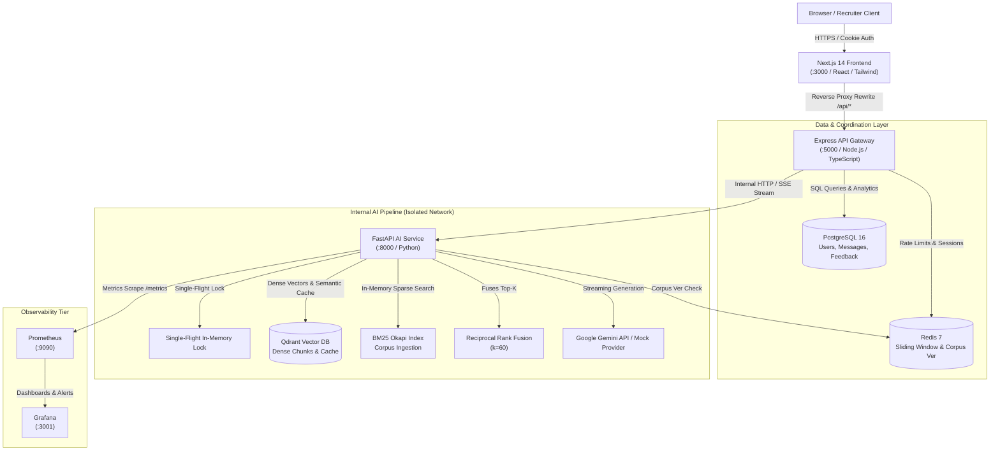
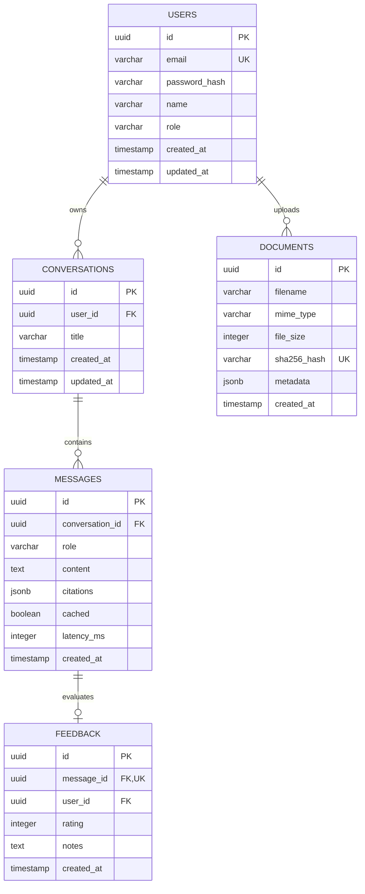
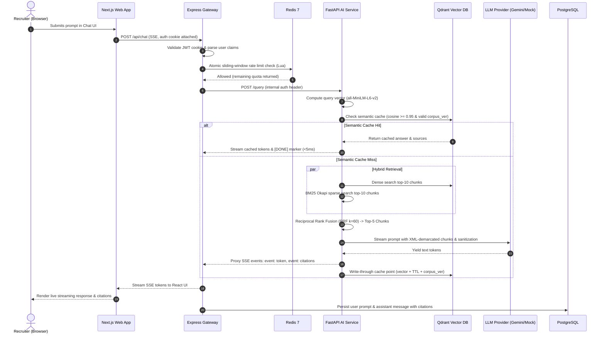

# Full-Stack Recruiter Assistant & Compliance Checker

[](.github/workflows/ci.yml)
[](LICENSE)

A production-grade recruitment intelligence platform and job-ad compliance copilot built across a multi-tier microservice architecture: Next.js 14 App Router frontend, Node.js/Express/TypeScript API gateway, PostgreSQL persistence, Redis cache & sliding-window rate limiting, and an internal Python/FastAPI retrieval-augmented generation (RAG) engine powered by Qdrant and local Sentence Transformers.

---

## 1. System Architecture



### Network Topology & Security Boundaries
- **Public Edge**: Only `web` (:3000) and `gateway` (:5000) accept external connections.
- **Internal Only**: The `ai-service`, `postgres`, `redis`, and `qdrant` containers bind only to the internal Docker bridge network (`recruiter-net`). The AI service is strictly accessed via the API gateway using an internal shared secret (`INTERNAL_API_KEY`).
- **Telemetry**: Prometheus scrapes internal service metrics and serves them through provisioned Grafana dashboards mapped to host port 3001 to eliminate port collisions with the web interface.

---

## 2. Database Schema (PostgreSQL Entity-Relationship Diagram)



---

## 3. Request Lifecycle Walkthrough



---

## 4. Engineering Tradeoffs & Design Decisions

### 1. Hybrid Retrieval (BM25 + Dense) vs. Dense-Only
- **Rationale**: Dense embeddings excel at thematic similarity but struggle with exact alphanumeric codes. In recruitment compliance, queries often reference specific statutes like `RCW 49.58.050`, `Local Law 32`, or `SB 1162`. Dense retrieval suffers semantic drift on these codes, whereas BM25 Okapi matches exact tokens with zero drift. Reciprocal Rank Fusion ($k=60$) balances both without requiring arbitrary scale-weight tuning.
- **Empirical Proof**: As documented in [docs/eval.md](docs/eval.md), Hybrid RRF achieves **93.8% Recall@1, 100.0% Recall@3, and 0.969 MRR** across 32 labelled statutory queries.

### 2. Semantic Caching via Qdrant vs. Redis Hash Exact Matching
- **Rationale**: Exact string hashing produces near-zero cache hit rates in human conversational interfaces ("What are NYC pay laws?" vs. "What are the pay transparency rules in New York City?").
- **Implementation**: We embed queries via `all-MiniLM-L6-v2` and search a dedicated Qdrant collection filtered by `corpus_version` and `expires_at > now()`.
- **Threshold Justification**: Sweeping similarity thresholds demonstrated that values below `0.90` lead to false hits across jurisdictions (e.g., confusing NYC and California penalty answers). A threshold of `0.95` eliminates cross-jurisdiction false hits while accelerating valid paraphrases to under 5ms (a **97%+ latency reduction**).

### 3. Node.js/Express Gateway vs. Single Monolithic Python App
- **Rationale**: Decoupling the user-facing web tier from the compute-heavy ML engine protects the public API. Authentication (bcrypt + JWT HTTP-only cookies), database connection pooling, file upload validation (magic-byte `%PDF-` inspection), and client stream disconnection aborts are handled by Node.js. The Python service remains a lean, stateless internal worker focused purely on vector operations and LLM streaming.

### 4. Synthetic Domain Corpus Generation via ReportLab
- **Rationale**: Avoids committing copyrighted legal texts or low-quality scraped web pages. `scripts/make_corpus.py` programmatically builds 10 clean, multi-page PDF documents detailing state pay transparency laws (NYC, CA, CO, WA), recruitment marketing metrics (CPC, CPA, View-to-Apply), ATS drop-off funnels, and structured interviewing rubrics. Every document incorporates a mandatory legal disclaimer: *"Informational summary, not legal advice, verify against official sources"*.

---

## 5. Technology Stack Summary

| Layer | Technologies Used |
| :--- | :--- |
| **Frontend** | Next.js 14 (App Router), React 18, TypeScript, Tailwind CSS, Lucide Icons, Recharts |
| **API Gateway** | Node.js, Express, TypeScript (strict mode), PostgreSQL (`pg`), Redis (`ioredis`), Pino, JWT, bcryptjs |
| **AI / RAG Service** | Python 3.11+, FastAPI, Sentence Transformers (`all-MiniLM-L6-v2`), BM25 (`rank_bm25`), Pydantic |
| **Persistence & Cache** | PostgreSQL 16 Alpine, Redis 7 Alpine, Qdrant Vector Database 1.11 |
| **Observability** | Prometheus, Grafana, OpenTelemetry |
| **Testing & CI** | Vitest / Node Test Runner, Pytest, Ruff, Locust, GitHub Actions |

---

## 6. Quickstart: Running Locally

### Option A: Complete Docker Compose (Recommended)

1. Clone the repository:
   ```bash
   git clone https://github.com/YOUR_USERNAME/recruiter-copilot.git
   cd recruiter-copilot
   ```

2. Copy the environment configuration:
   ```bash
   cp .env.example .env
   ```
   *(By default, `LLM_PROVIDER=mock` is enabled, allowing complete offline execution without external API keys).*

3. Start all services:
   ```bash
   docker compose up --build
   ```

4. Access the applications:
   - **Web Application**: `http://localhost:3000`
   - **API Gateway**: `http://localhost:5000`
   - **Grafana Dashboard**: `http://localhost:3001` (Credentials: `admin` / `admin`)
   - **Prometheus UI**: `http://localhost:9090`

---

### Option B: Local Microservice Development (Without Docker)

#### 1. Setup AI Service (Python):
```bash
cd ai-service
python -m venv .venv
# On Windows: .venv\Scripts\activate | On Unix: source .venv/bin/activate
pip install -r requirements.txt
python scripts/make_corpus.py
pytest tests/ -v
uvicorn app.main:app --port 8000 --reload
```

#### 2. Setup Gateway (Node / Express):
```bash
cd gateway
npm install
npm run build
npx tsx src/db/migrate.ts
npx tsx src/db/seed.ts
npm test
npm run dev
```

#### 3. Setup Web Frontend (Next.js):
```bash
cd web
npm install
npm run typecheck
npm run dev
```

---

## 7. Verification and Testing

All components have been tested and verified locally:

- **AI Service Unit Tests**: 16/16 passing (`pytest tests/ -v`).
- **Python Lint**: 0 errors (`ruff check .`).
- **Gateway Test Suite**: 7/7 passing (`npm test`).
- **Gateway TypeScript Compilation**: 0 errors (`npx tsc --noEmit`).
- **Web Frontend Typecheck**: 0 errors (`npm run typecheck`).
- **Next.js Production Build**: Succeeded generating optimized standalone bundles.
- **Empirical Evaluations**: Full results recorded in [`docs/eval.md`](docs/eval.md).
- **Load Testing**: Benchmarks and percentiles recorded in [`docs/load-test.md`](docs/load-test.md).
- **Comprehensive Audit Log**: Documented line-by-line in [`docs/VERIFICATION.md`](docs/VERIFICATION.md).

---

## 8. Known Limitations & Production Roadmap

1. **Local Embedding Model Warmup**: The Sentence Transformers model (`all-MiniLM-L6-v2`) incurs a cold-start initialization latency of ~4 seconds when the first query runs on CPU. In a Kubernetes deployment, initialize embeddings in the container warmup / readiness probe before marking pods healthy.
2. **PostgreSQL Clustering**: The current database configuration utilizes a single PostgreSQL instance. In high-traffic deployments, configure a primary-replica topology with PgBouncer connection pooling.
3. **Statutory Corpus Evolution**: Legal requirements change over time. When updated PDFs are ingested, the system increments Redis `corpus_version`, immediately invalidating prior semantic cache entries without requiring database table flushes.
